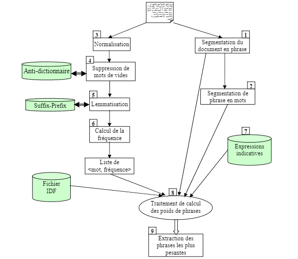

# Health and Genetics Text Summarizer with LAKHAS Architecture

## Project Overview:

Develop an automatic text summarization system specialized for health and genetics scientific texts, implementing the LAKHAS architecture proposed by Fouad Soufiane Douzidia (University of Montreal) in 2004. This project aims to create a tool capable of processing and summarizing scientific documents in the health and genetics domain, leveraging the principles of the LAKHAS architecture.

## LAKHAS Architecture Description:

The LAKHAS architecture, originally designed for Arabic texts, is primarily based on extraction techniques for automatic summarization. Developed by Fouad Soufiane Douzidia, it provides a functional implementation through key components:

- **Linguistic Analysis (LA):** The text undergoes linguistic analysis, including segmentation at various levels. This is crucial for breaking down the scientific document into meaningful units, laying the groundwork for subsequent processing.

- **Text Segmentation into Phrases:** Divide the text into phrases, essential for subsequent linguistic and semantic analysis.

- **Phrases Segmentation into Words:** Further break down each phrase into individual words, facilitating detailed analysis.

- **Normalization:** Standardize the text by converting uppercase to lowercase, handling acronyms, and ensuring consistent formatting of values like dates and numbers.

- **Removal of Stopwords:** Eliminate common stopwords to focus on meaningful content during analysis.

- **Lemmatization:** Reduce words to their base or root form, aiding in semantic analysis and improving the accuracy of weight calculations.

- **Frequency Calculation:** Determine the frequency of each word in the processed text to assess its significance.

- **Weights Calculation of Phrases:** Assign weights to phrases based on various criteria, including cue phrases, keywords, title words, position, and connectivity of sentences.

- **Extraction of N Most Weighted Phrases:** Obtain a concise summary by extracting the N most weighted phrases from the processed text.

## Implementation Steps:

1. **Linguistic Analysis (LA):** The text undergoes linguistic analysis, including segmentation at various levels. This is crucial for breaking down the scientific document into meaningful units, laying the groundwork for subsequent processing.

2. **Text Segmentation into Phrases:** Divide the text into phrases, essential for subsequent linguistic and semantic analysis.

3. **Phrases Segmentation into Words:** Further break down each phrase into individual words, facilitating detailed analysis.

4. **Normalization:** Standardize the text by converting uppercase to lowercase, handling acronyms, and ensuring consistent formatting of values like dates and numbers.

5. **Removal of Stopwords:** Eliminate common stopwords to focus on meaningful content during analysis.

6. **Lemmatization:** Reduce words to their base or root form, aiding in semantic analysis and improving the accuracy of weight calculations.

7. **Frequency Calculation:** Determine the frequency of each word in the processed text to assess its significance.

8. **Weights Calculation of Phrases:** Assign weights to phrases based on various criteria, including cue phrases, keywords, title words, position, and connectivity of sentences.

9. **Extraction of N Most Weighted Phrases:** Obtain a concise summary by extracting the N most weighted phrases from the processed text.

## Files:

The project consists of three files:
1. `scientific_lakhas.py`: Contains the implementation of the summarization class.
2. `scientific_text_indicators.py`: Contains the implementation of the indicators class.
3. `Experimentation.ipynb`: Jupyter notebook for experimentation and testing.

## How to Use:

- Clone the repository: `git clone <repository-url>`
- Navigate to the project directory: `cd ScLakhas`
- Run the experimentation notebook: `jupyter notebook experimentation.ipynb`

Feel free to explore the code, experiment with different texts, and optimize the summarization process for your specific use case.

## License:

This project is licensed under the [MIT License](./LICENSE).
